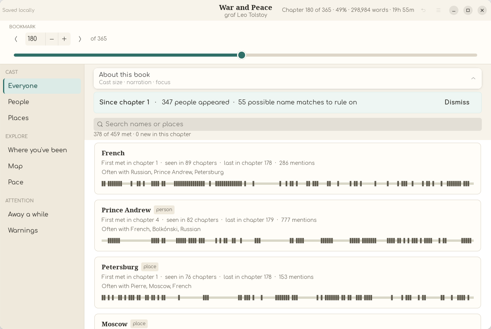
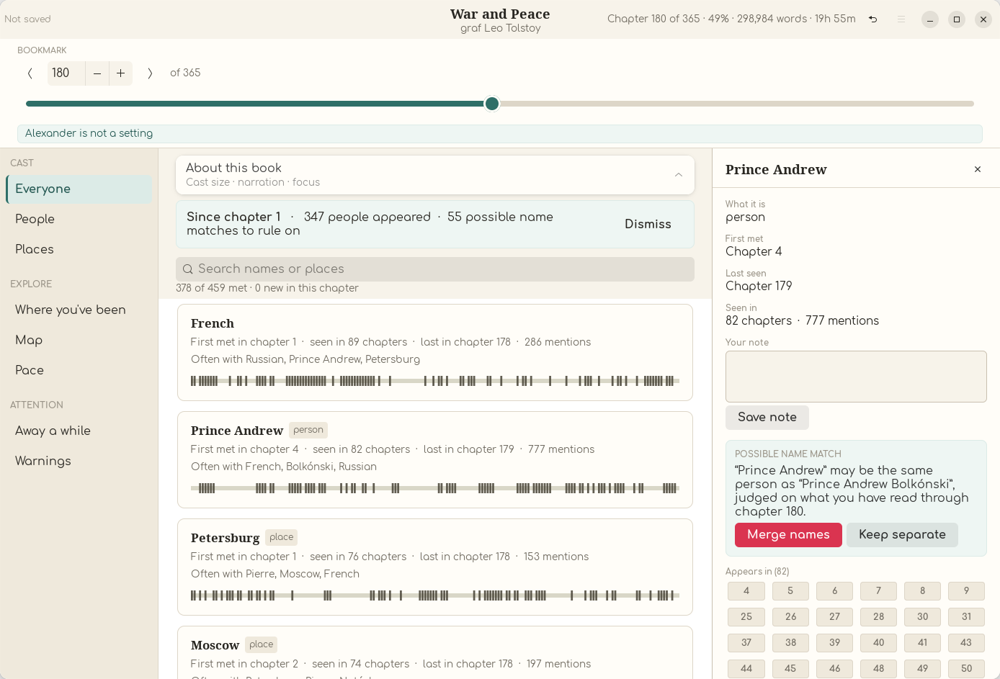
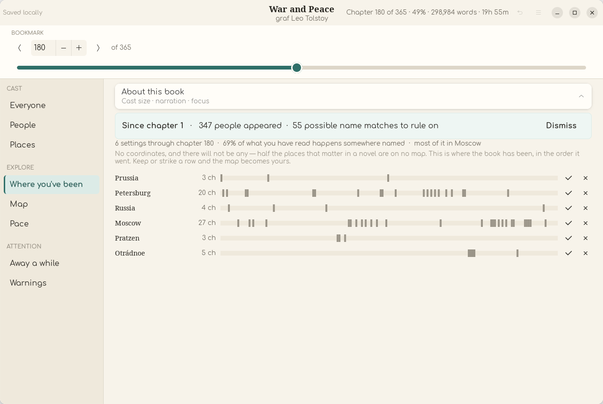
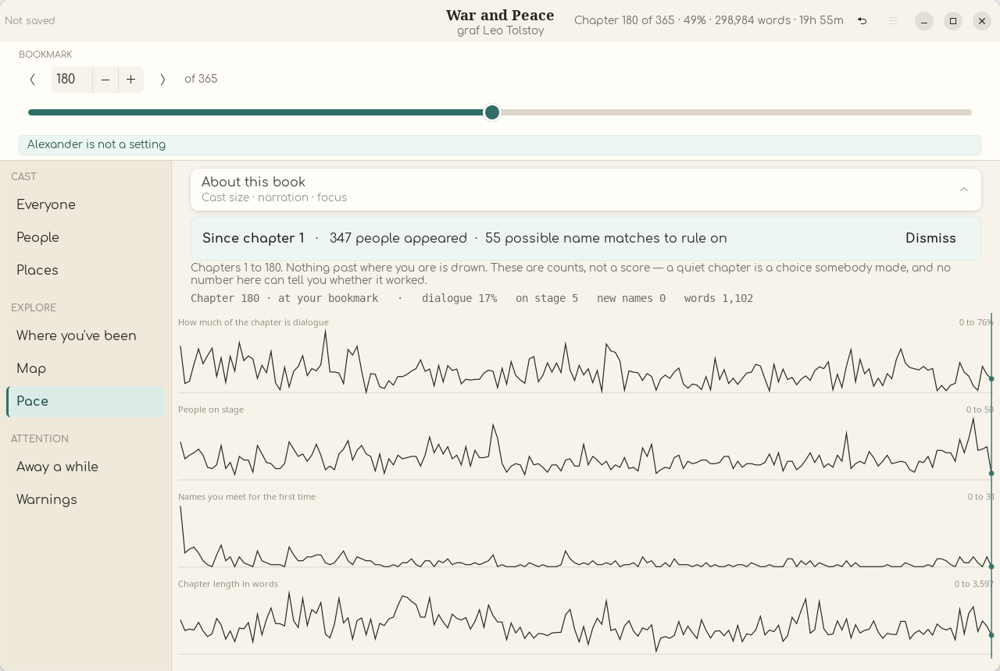

# ariadne

[](https://github.com/kingletas/ariadne/actions/workflows/ci.yml)
[](LICENSE)

**You are three hundred pages into a long novel, somebody walks into the room, and you have no idea who they are.**

Every place you could look to find out will tell you something you have not reached. A wiki article is written from the ending. A character list on a retail page names who survives to be worth naming. Searching the name finds a forum thread about what they do in the last act. So you either read on and stay lost, or you spoil the book to stop being lost — and a lot of people just put it down. That is the problem this is for.

The blurb was never going to save you. Measured over 113 fiction nominees from the 2025 Goodreads Choice Awards, **a synopsis names a median of two people**; over 53 novels measured whole, a book has introduced nineteen by a tenth of the way in and finishes with sixty.

## What Ariadne does about it

**It builds the book's cast as you read it, from your own copy, and shows you nothing past your bookmark.**

Point it at a book you own. It reads the file, works out who appears in which chapter, and gives you an index with a bookmark on it. Move the bookmark to chapter 40 and you see the book as it stands at chapter 40 — who you have met, who you have not seen for a while, who tends to be in the room with whom, where the book has been. Chapter 41 does not exist in the view.

**The spoiler rule is structural, not a filter.** Every view is built from the chapters behind your position, so there is no later data sitting in the page waiting to be revealed by a bug. That property is asserted by a test that runs on every commit.



> **Early days.** It works on the sixteen books below and on any DRM-free epub you own. It is also convinced that Moby Dick is a place until you tell it otherwise, and nobody has read a whole book with it yet.

## Installing it

**From a release** — the `.deb` is on the [releases page](https://github.com/kingletas/ariadne/releases):

```bash
sudo apt install ./ariadne_*_all.deb
```

**As a Flatpak** — the bundle is on the [releases page](https://github.com/kingletas/ariadne/releases) beside the `.deb`:

```bash
flatpak install ./ariadne_0.1.0.flatpak
```

Or build one yourself with `make flatpak` to install it locally, or `make bundle` for the single file.

Needs `org.gnome.Platform//50` and `org.gnome.Sdk//50`. It asks for your home directory, because the file it writes for your rulings goes next to the book and the file portal only grants the one file you picked. It asks for no network at all.

**From a clone:**

```bash
make venv && make install
```

That puts `ariadne` on your `PATH` and a launcher entry in your applications menu. `make help` lists everything else, and `make uninstall` removes all of it.

> **Pick one or the other.** `make install` puts a wrapper in `~/bin`, which on most setups comes before `/usr/bin` on `PATH` — so with both present, `ariadne` is the wrapper and the packaged binary is never reached. `which -a ariadne` settles it.

**Python 3.12 or newer, and nothing else** — the engine needs only the standard library, and `tests/test_layering.py` proves it by importing every engine module with the toolkit blocked.

### If the window does not open

The GTK parts come from your system rather than from pip, so they may not be there. Run:

```bash
ariadne --doctor
```

It says what is missing and gives you the command to install it. Everything else works fine without them — pages, `--inspect`, `--about`, `--refusals`, the whole command line.

## The desktop reader

```bash
ariadne ~/Books/some-book.epub --app
```

Or open Ariadne from your applications menu and pick a book.

The window shows what the page shows, and here you can also correct it. When it lists Prince Andrew and Prince Andrew Bolkónski as two people, click one and tell it they are the same man. Notes, merges and warnings go into a small file next to the book, and there are fifty steps of undo.

Down the left: everyone you have met, split into people and places. A map of who shares chapters with whom. Where the book has been. A pace chart. Click any name and a panel opens with everything known about them so far, and nothing after.



It does not guess at any of this. Two names might be one person or they might be two, and in some books that is the plot.

### Where the book has been



One row per place, chapters running left to right, in the order the book got to them. Reading down the list is reading the journey.

It is not a map of the world and will not become one. Bald Hills and Thrushcross Grange are not on any map, and there are two Ithacas. What this draws is where the book spends its time.

Each row starts as a guess. The guess is right about four times in five, so you keep or bin each one — Moby Dick is a whale.

### Pace



How much of the chapter is dialogue, how many people are in it, how many names are new, and how long it runs. Move the cursor and all four move together, so you can see that chapter 140 was quiet and crowded at the same time.

There is no score anywhere on it. A slow chapter might be exactly what the author wanted.

## Making a page

```bash
ariadne ~/Books/some-book.epub -o some-book.html
```

An epub, a Word document, a folder of Markdown, or plain text. It takes about a second, even for War and Peace.

What comes out is one HTML file. No install, no account, nothing to sign up for, and it works offline. It contains no text from the book at all — names, counts and chapter numbers — so you can send it to a friend reading the same thing.

```bash
ariadne <file> --inspect     # what it found, without writing anything
ariadne <file> --about       # what you are in for, before you start
```

## What it will not do

Of 59 books tried, it handles 48. The other 11 it turns down and tells you why, usually because it cannot work out where the chapters start.

It also will not tell you who is speaking a line of dialogue, decide whether something was written by a machine, match a book against other authors to guess who wrote it, or give a book a score.

```bash
ariadne --refusals
```

Each of those has a reason and a number behind it. Attributing dialogue, for instance, works on 6.6% of lines — which is not a rough answer, it is a wrong one nine times out of ten.

## Warning yourself about a chapter

```bash
ariadne book.epub --warn "24=someone does not make it through this chapter"
```

At chapter 23 it says *something is coming* and keeps the text folded shut until you open it.

Ariadne finds none of these itself. Tagging books by what happens in them is a fight it has no business joining, and a false positive costs somebody a book they would have been fine with. The warning is yours, it sits in the file next to the book, and you can hand it to someone else reading it.

## Layout

```text
src/ariadne/
  core/         the refusal, the tunable numbers, the quoted-span pattern
  ingest/       files in, chapters out
  model/        chapters in, the index out — and the clipping every view uses
  decisions/    the reader's own rulings, in a sidecar beside the book
  position/     where the reader is
  analysis/     what can be said about a book without spoiling it
  ai/           the two commands that need an account
  invariant.py  the property that must never regress
  render/       the page
  app/          the desktop reader
  cli/          the command line
```

Each layer may use the ones above it and none below. The engine is everything above `render`, and it runs on a machine with no GUI toolkit at all.

Neither of those is a promise in a file. `tests/test_layering.py` reads the imports, fails on a folder nobody declared, and imports the whole engine in a subprocess with GTK blocked.

## Reading further

| | |
|---|---|
| [Getting started](docs/getting-started.md) | Install it, open a book, and what to do first |
| [CONTRIBUTING.md](CONTRIBUTING.md) | How to change it without breaking the one rule |
| [SECURITY.md](SECURITY.md) | What it reads, what leaves your machine, and what is still open |
| [CHANGELOG.md](CHANGELOG.md) | What changed |

## License

MIT. See [LICENSE](LICENSE).
